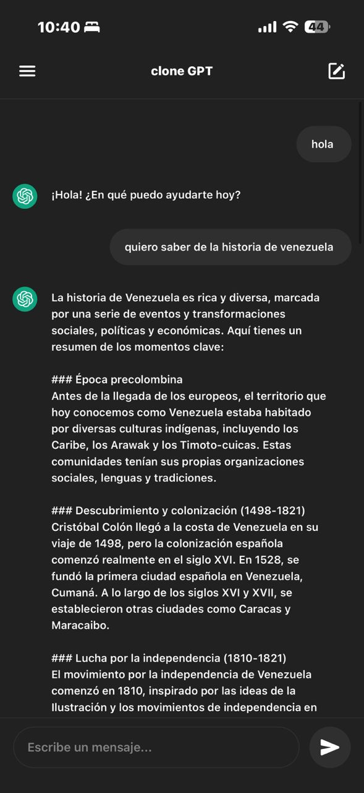

# ChatGPT Clone - Mobile App 🚀

Un clon funcional y estéticamente premium de la aplicación móvil de ChatGPT, construido con **React Native (Expo)** para el frontend y **FastAPI (Python)** para el backend.



## ✨ Características

- **Interfaz de Usuario Premium**: Clonación fiel de la paleta de colores y tipografía de ChatGPT.
- **Animaciones Suaves**: Logo de OpenAI animado al inicio de la aplicación.
- **Manejo Inteligente del Teclado**: Ajuste instantáneo del layout para una experiencia de escritura fluida.
- **Backend Robusto**: Integración con la API de OpenAI (GPT-4o-mini) mediante FastAPI.
- **Gestión de Estado Global**: Uso de Context API para manejar la conversación y el estado de carga.

## 🛠️ Tecnologías Utilizadas

### Frontend
- [React Native](https://reactnative.dev/) (Expo)
- [React Navigation](https://reactnavigation.org/)
- [Context API](https://reactjs.org/docs/context.html)
- [Lucide Icons / Expo Vector Icons](https://icons.expo.fyi/)

### Backend
- [Python 3.10+](https://www.python.org/)
- [FastAPI](https://fastapi.tiangolo.com/)
- [OpenAI Python Library](https://github.com/openai/openai-python)
- [Uvicorn](https://www.uvicorn.org/)

## 🚀 Instalación y Uso

### 1. Clonar el repositorio
```bash
git clone https://github.com/tu-usuario/gpt-clone.git
cd gpt-clone
```

### 2. Configuración del Backend
```bash
cd backend
# Crear entorno virtual (opcional)
python -m venv venv
source venv/bin/activate # En Windows: venv\Scripts\activate

# Instalar dependencias
pip install -r requirements.txt

# Configurar .env
# Crea un archivo .env con tu API_KEY de OpenAI:
# API_KEY=tu_api_key_aqui

# Iniciar servidor
uvicorn app:app --reload --port 5000 --host 0.0.0.0
```

### 3. Configuración del Frontend
```bash
cd frontend
# Instalar dependencias
npm install

# Configurar .env
# Crea un archivo .env con la IP de tu computadora:
# EXPO_PUBLIC_API_URL=http://TU_IP_LOCAL:5000

# Iniciar Expo
npx expo start -c
```

## 📱 Notas de Desarrollo
- Para probar en un dispositivo físico con Expo Go, asegúrate de que tanto el teléfono como la PC estén en la misma red Wi-Fi y usa la IP local en el archivo `.env` del frontend.
- El servidor de backend debe iniciarse con `--host 0.0.0.0` para permitir conexiones externas.

---
Desarrollado con ❤️ para el portafolio de **Carlos Salazar**.
